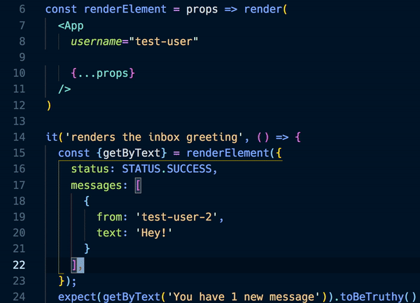

Behold! Save time and frustration when switching between JSX prop and JS object entry syntaxes using the "Convert Object to JSX" extension for VS Code. One common usecase is for establishing shared props for component tests, although you'll likely start finding other creative applications to cut out extra keystrokes.

  

I've wanted to automate this process for a couple years, but it wasn't until investing more in Jest testing React components that I encountered this hassle frequently enough to warrant solving it. This felt like a small missing piece in a coding world full of magic like Prettier formatting, codemods, and refactoring Code Actions.

## Notes on Implementation

Given those cited sources of inspiration, it may seem like this tool would also be a natural fit for doing code transformation through abstract syntax trees. However, this would lead to a few complications:

1. Code jumpiness before & after. Even if the result was formatted according to your preferences, minor differences in character counts between formats would result in lines breaking, merging, or shifting. It's much easier to trust a tool that minimizes surprise and has visibly verifiable results.
1. Parsing into an AST means also having to choose how to print it out. If the result has lines shifting, you'd at least expect it to output it the way you'd format it yourself. That expectation would set an unnecessary burden on the extension, needlessly emulating work that would be handled by Format on Save.
1. The code selection on its own is not valid JavaScript. To make the selection parsable, that selection would need to be placed within a dummy element to be understood as a component or wrapped in braces to be interpreted as an object. Those additions would need to be undone after printing the converted AST, which could also impact how the result would have otherwise been formatted.

I wrote out the above points to convince myself that the remaining option of using straight-up regular expressions wasn't a sign of defeat. I took comfort in how [related formatting extensions](https://github.com/ansumanshah/css-in-js#convert-css-in-js) also settled on string manipulation.

Regular expressions at first felt ill-equipped to handle separating fields or props from each other, which was crucial so that each entry could then be converted individually. Determining where one stopped and another began couldn't be as simple as finding the next comma, quote, or closing brace since those characters could show up in a string or would be used in a multiline object value.

As in all projects, rigidly defining scope and expected uses dramatically shaped development possibilities.

I knew I didn't care to work with arbitrary code dumps. I only wanted to support selections that had already been formatted. Crucially this meant all keys or props would be preceded by the exact same amount of indentation, and all values would be indented further if they stretched over multiple lines. Now the text selection could easily be separated by a regex finding all identifiers preceded by that amount of indentation, rather than having to carefully solve finding matching opening and closing characters. This requirement dramatically simplified the implementation and has proven flexible enough to even support object shorthand, JSX shorthand, object spread, and prop-getter entries.

Implementing the transformation with the admittedly-less-cool approach and picking helpful constraints has helped bring this extension to life in a way that provides an invisible, out-of-the-way user experience.

## Try it out

Now that you know some of the internals, go ahead and [try it out](https://marketplace.visualstudio.com/items?itemName=zachgawlik.convert-object-to-jsx) or [view the code](https://github.com/ZachGawlik/vscode-convert-object-to-jsx).

  

